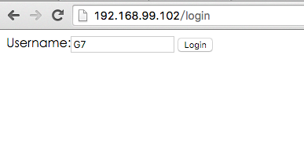
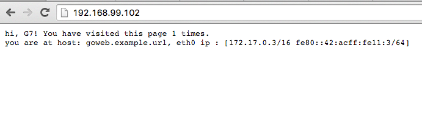
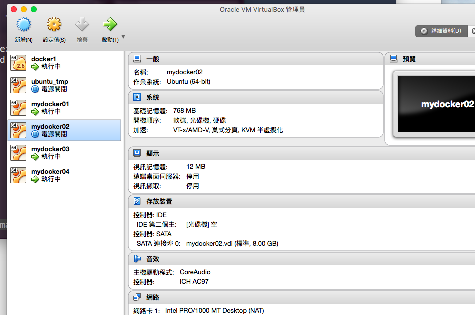
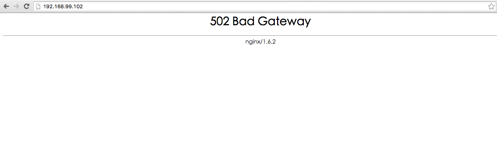
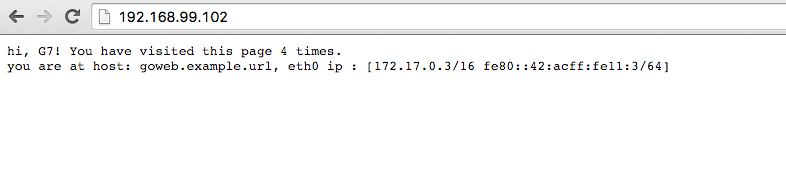
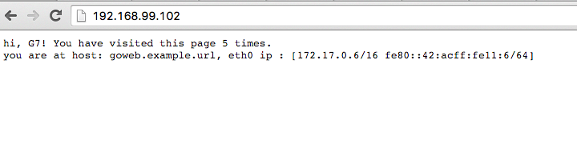
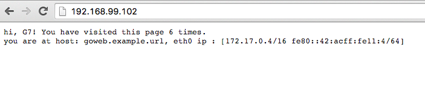

# High available & dynamically scale with swarm + consul
利用 swarm + consul 架構一個基於 docker 的基礎建設  
每個元件都包成 docker image
可以做到
- 機器無預警關機時服務可自動在另一台機器啟動
- 服務 loading 附載超過臨界值時，可以動態在其他機器新增服務做負載均衡
- 在上述兩種情況皆保存用戶的 session 

詳細說明請參考[架構說明](http://genchilu-blog.logdown.com/posts/317095-based-on-swarm-and-consul-ha-and-dynamically-extensible-architectures)  
## 簡單架設步驟如下  
準備四台裝好 docker 的vm，一台 master，三台 nodes  
docker daemon 啟動時需加入下列參數 "-H 0.0.0.0:2376 -H unix:///var/run/docker.sock"
### 在  master 上安裝 consul
```sh
$ docker run -d -p 8400:8400 -p 8500:8500 -p 8600:53/udp -h node1 --name consul progrium/consul -server -bootstrap
```
#### 測試 consul
```sh
$ curl -L http://master_ip:8500/v1/catalog/nodes
[{"Node":"node1","Address":"172.17.0.2"}]
```
### 安裝 swarm
#### 在三台 nodes 上啟動 swarm
```sh
$ docker run -d --name swarm swarm join --advertise=node_ip:2376 consul://master_ip:8500/v1/kv/swarm
```
#### 在 master 上安裝 swarm manager
```sh
$ docker run -d -p 4000:4000 --name swarm swarm manage consul://master_ip:8500/v1/kv/swarm
```
#### 測試 swarm 集群是否正常運作
```sh
$ docker -H master_ip:4000 info
Containers: 3
Images: 4
Role: primary
Strategy: spread
Filters: health, port, dependency, affinity, constraint
Nodes: 3
 docker01: docker01:2375
  └ Containers: 1
  └ Reserved CPUs: 0 / 1
  └ Reserved Memory: 0 B / 778.3 MiB
  └ Labels: executiondriver=native-0.2, kernelversion=3.19.0-28-generic, operatingsystem=Ubuntu 14.04.3 LTS, storagedriver=aufs
 docker02: docker02:2375
  └ Containers: 1
  └ Reserved CPUs: 0 / 1
  └ Reserved Memory: 0 B / 778.3 MiB
  └ Labels: executiondriver=native-0.2, kernelversion=3.19.0-28-generic, operatingsystem=Ubuntu 14.04.3 LTS, storagedriver=aufs
 docker03: docker03:2375
  └ Containers: 1
  └ Reserved CPUs: 0 / 1
  └ Reserved Memory: 0 B / 778.3 MiB
  └ Labels: executiondriver=native-0.2, kernelversion=3.19.0-28-generic, operatingsystem=Ubuntu 14.04.3 LTS, storagedriver=aufs
CPUs: 3
Total Memory: 2.28 GiB
Name: 04511c8c45b8
```
### 啟動 interlock 的 nginx plugin
```
docker run -d --name interlock --restart=always ehazlett/interlock --swarm-url tcp://master_ip:4000 --plugin nginx start
```
### 啟動用域名訪問 interlock 的 nginx (Dockerfile 放在 nginx 目錄)
```
docker run -d -p 80:80 --link interlock:goweb.example.url genchilu/nginx
```
### 啟動 redis 存 session (Dockerfile 放在 redis 目錄)
```
dockeurme run -d --name redis-server -p 6379:6379 --restart=always genchilu/redis
```
### 啟動 demo 用的 example web (Dockerfile 和 source code 放在 goWeb 目錄)
```
docker -H master_ip:4000 run -d -P -h goweb.example.url --restart=always genchilu/go-web-example -sessiontype=redis -redisinfo=master_ip:6379 -sessionlifetime=3000
```

### 監控 swarm cluster 中有無 demo 用的 web container (Dockerfile 放在 checkAlive 目錄)
```
docker run -ti --rm genchilu/checkalive -a "-sessiontype=redis -redisinfo=master_ip:6379 -sessionlifetime=3000" -i "genchilu/go-web-example" -o "-d -P -h goweb.example.url --restart=always" -s "master_ip:4000" -t 10
```
## demo
### HA
打開瀏覽器輸入 http://master_ip  
  
登入後可看到使用者，瀏覽次數和此時服務所在的 container 的 ip  
(refresh 頁面瀏覽次數會增加)

在 master 上輸入下列指令查找當前服務部署在那一台機器
```
$>docker -H master_ip:4000 ps
CONTAINER ID        IMAGE                     COMMAND                  CREATED                  STATUS                  PORTS                            NAMES
a0e3bbc78c4d        genchilu/go-web-example   "/main -sessiontype=r"   Less than a second ago   Up Less than a second   192.168.99.109:32770->8080/tcp   mydocker02/condescending_goldstine
```
直接把 mydocker02 關機
  
此時瀏覽 http://master_ip 會出現 502 錯誤
  
等約兩到三分鐘(時間長短取決於 swarm cluster 對節點失敗的訊息同步到 manager 的速度)  
再重新瀏覽 http://master_ip 可發現網頁自動恢復，且保有上次登入的 session  

### scale up & load balancing
在 master 上連續發佈 demo 用的 web
```
# 每輸入一次及發佈一次
docker -H master_ip:4000 run -d -P -h goweb.example.url --restart=always genchilu/go-web-example -sessiontype=redis -redisinfo=master_ip:6379 -sessionlifetime=3000
```
瀏覽 http://master_ip 後持續刷新，會發現 ip 會不同



